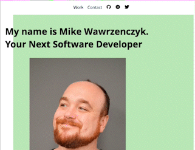
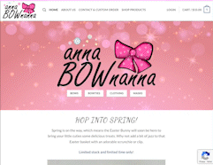

Hi there! 

👨🏻‍💻 About Me:
<h3>I am a Software Developer with over ten years of IT, application analysis, and training experience. Bringing out the best in teams I am involved with, helping complete business processes. Completed a college diploma in Web Development and freelanced as I started an IT career. I have decided I have a more incredible passion for software development and being customer facing I want to work on software that I love to solve problems and help people.</h3>
<h3>Feel free to contact me out my <a href='https://michalw.com/contact.html' alt='Mike Wawrzenczyk Portfolio'>portfolio</a></h3>

<!--Project Section -->

<h2 align="center">Projects</h2>

<table>
<tr>
<td width="50%">
<h3 align="center" color="white">Portfolio Site</h2>
    
  
    <a href='https://www.michalw.com'>
     
    
    </a>
     
     
    

    
    

    
<strong>HTML5, CSS3, Javascript</strong>Created a new abstract and responsive portfolio site which I use for freelance business as well as showing off my projects! Simple yet elegant design which loads fast on desktop and mobile.

    

</td>
<td width="50%">
<h3 align="center" color="white">AnnaBownanna Client Site</h2>

  
<a href='https://www.annabownanna.com'>
 

</a>
 
 

<strong>HTML5, CSS3, Javascript, PHP, Wordpress</strong>Children's clothes e-commerce business. Responsive design, built with CMS in mind so customer can do own updates as well e-commerce plugins to get payments and add inventory.

</table>

<h2>🛠️ Technologies and Tools I use:</h2>
 

 
    
    
    

      
    
    

<!--
**mikewawrzenczyk/mikewawrzenczyk** is a ✨ _special_ ✨ repository because its `README.md` (this file) appears on your GitHub profile.

Here are some ideas to get you started:

- 🔭 I’m currently working on ...
- 🌱 I’m currently learning ...
- 👯 I’m looking to collaborate on ...
- 🤔 I’m looking for help with ...
- 💬 Ask me about ...
- 📫 How to reach me: ...
- 😄 Pronouns: ...
- ⚡ Fun fact: ...
-->
